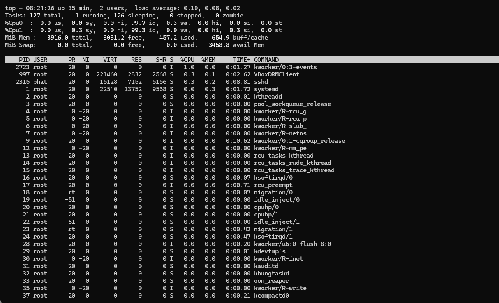
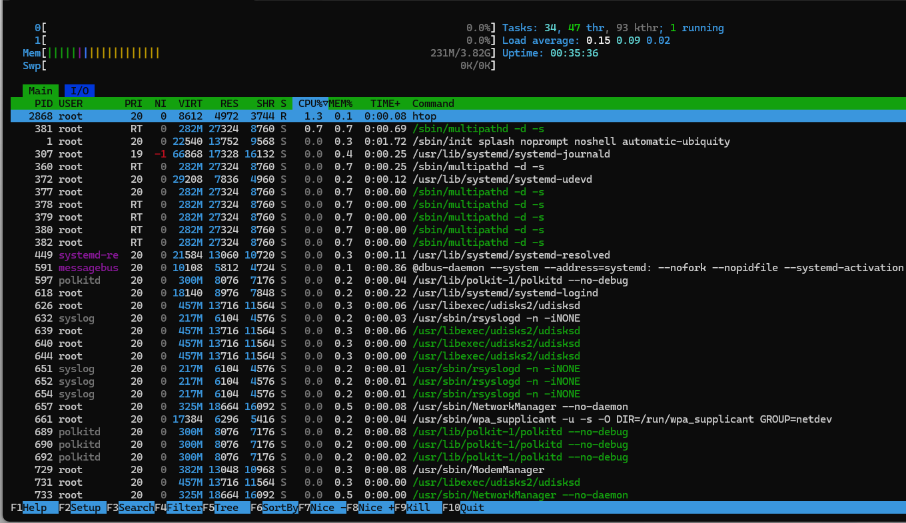

# Day01: Linux + Terminal + Git

## Mục tiêu
 - Set up Ubuntu trên Virturbox 
 - Ôn lại các khái niệm Linux cơ bản
 - Thực hành Terminal
 - Set up Git report hằng ngày

 ## Công việc thực hiện:
 1. Chuẩn bị môi trường
  - Tải Ubuntu Server 24.04 LTS
  - Tạo máy ảo trên VirtualBox
    #Link tham khảo: https://linuxvox.com/blog/how-to-setup-ubuntu-virtualbox/
        

    ### Cấu hình máy ảo

        - Ubuntu Server 24.04 LTS
        - CPU: 2 vCPU
        - RAM: 4 GB
        - Disk: 60 GB
        - Network: NAT + Port Forwarding
        - SSH: Enabled

    

    1.1 Cài đặt Openssh: https://www.golinuxcloud.com/ssh-into-virtualbox-vm/
        - Cài gói openssh-server
        
        - Check Network
        - Check port
        - Access với root (cần đổi password: sudo )
          + NAT + port forwarding: 2222 -> 22
            

  - Cấu hình CPU, RAM, Disk
    + các gói apt: htop, iotop,sysstat
    
    
    
    
  2. Thực hành Terminals
  3. Thực hành Git
  # Workflow thực hiện:
   - Tạo branch làm việc riêng:
        git checkout -b feature/day01-report
   - Cập nhật nội dung báo cáo trong notes.md.
   - Kiểm tra thay đổi:
        git status
        
   - Đẩy vào staging:
        git add .
   - Tạo commit:
        git commit -m "Day01: Linux environment setup"
   - Đẩy code lên GitHub:
        git push origin feature/day01-report
   - Tạo Pull Request để review và merge vào nhánh main.

Hoàn thành quy trình Git cơ bản từ tạo branch → commit → push → pull request → merge.