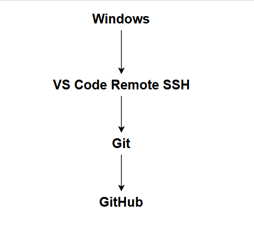

# Python Development Environment & Python Fundamentals

## Objective

    Set up a Python development environment on Ubuntu VM and practice basic Python programming.

## Environment Setup

    VS Code Remote SSH

        - Connected VS Code on Windows to Ubuntu VM using Remote SSH.
        - GitHub SSH Authentication
        - Configured SSH authentication between Ubuntu VM and GitHub.

    Tasks completed:

        - Generated SSH key pair.
        - Added public key to GitHub.
        - Successfully pushed code to GitHub repository.

    Development Workflow

    

## Python Basics

    Topics practiced:

        - Variables
        - User Input
        - Functions
        - Modules
        - Import
        - Return
        - Conditional Statements

    Practice Files
        - hello.py
        - variables.py
        - calculator.py

   
### Mini Project 01 - Student Score Management
    Project Structure

        QLSV/
        ├── main.py
        ├── student.py
        ├── score.py
        └── report.py

    Features
        - Input student information.
        - Input subject scores.
        - Calculate average score.
        - Classify student performance.
        - Generate report.

### Mini Project 02 - Bus Management System
    Project Structure
        BusManagement/
        ├── main.py
        ├── bus.py
        ├── revenue.py
        └── report.py

    Features
        - Input bus information.
        - Input route information.
        - Input total seats.
        - Input sold tickets.
        - Calculate available seats.
        - Calculate revenue.
        - Generate report.

    Validation
    - Sold tickets cannot exceed total seats.
    - Total seats must be greater than zero.
    - Ticket price must be greater than zero.
