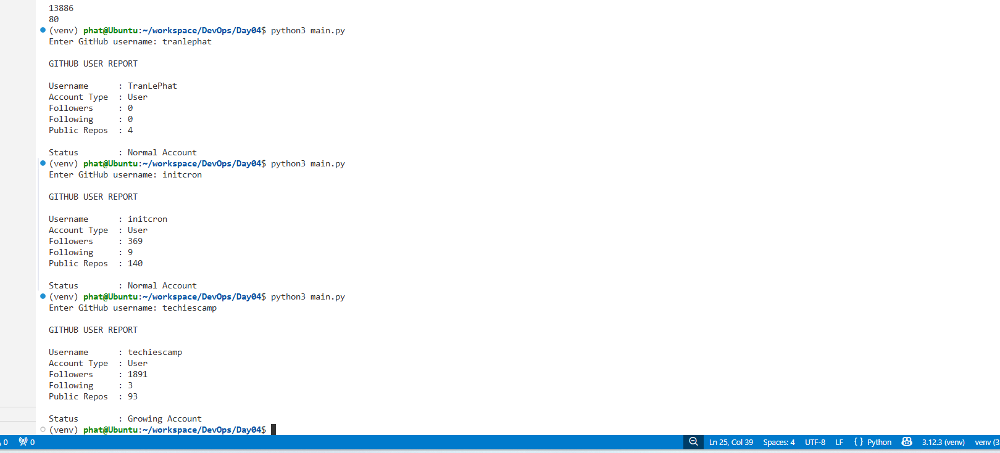

# Day04 - Python for DevOps

## Topic

API Integration, JSON Processing, Virtual Environment, and Configuration Management.

---

## Objective

The objective of today's session was to learn how Python can be used in DevOps automation tasks such as working with APIs, processing JSON data, managing Python environments, and handling configuration files.

---

## Activities

### 1. Python Virtual Environment

Created and activated a Python virtual environment.

Commands used:

```bash
python3 -m venv venv
source venv/bin/activate
```

Tasks completed:

* Created a virtual environment.
* Activated the environment.
* Installed Python packages using pip.
* Generated a requirements.txt file.

---

### 2. GitHub API Practice

Created a simple GitHub User Analyzer using the GitHub API.

Tasks completed:

* Installed the `requests` package.
* Sent requests to the GitHub API.
* Received JSON responses.
* Extracted useful information from JSON data.
* Displayed user information in a report.

Information retrieved:

* Username
* Account Type
* Followers
* Following
* Public Repositories

### Evidence



---

### 3. Configuration Manager Project

Created a simple Configuration Manager project.

Project structure:

```text
ConfigManager/
├── main.py
├── config_reader.py
├── config_writer.py
├── report.py
└── server.conf
```

Features implemented:

* Read configuration data from a file.
* Store configuration values in a dictionary.
* Display current configuration.
* Update configuration values.
* Save changes back to the file.
* Generate a simple update report.

---

### 4. Backup Improvement

Improved the backup mechanism to support multiple backup versions.

Example:

```text
server.conf.bak1
server.conf.bak2
server.conf.bak3
```

This prevents previous backups from being overwritten and helps keep configuration history.

---

## Results

Successfully completed:

* Python virtual environment setup.
* Package management using pip.
* GitHub API integration.
* JSON data processing.
* GitHub User Analyzer project.
* Configuration Manager project.
* Multi-version backup implementation.

---

## What I Learned

* Learned how Python virtual environments isolate project dependencies.
* Learned how APIs communicate using JSON data.
* Practiced sending HTTP requests and processing API responses.
* Learned how configuration files can be read and updated using Python.
* Understood why backups are important before modifying configuration files.
* Improved the project by creating multiple backup versions instead of overwriting old backups.

---

