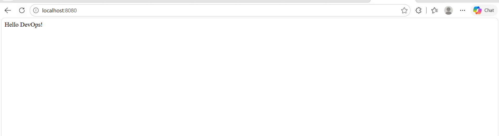

# Objective

Build and run a simple Python Flask application using Docker.

# What I Learned

* Created a basic Flask application.
* Managed dependencies with `requirements.txt`.
* Built a multi-stage Docker image.
* Used `python:3.9-slim` as the base image.
* Exposed port `8080`.
* Ran the container and verified the application with `curl`.

# Commands

```bash
docker build -t myapp:latest .
docker run -d -p 8080:8080 myapp:latest
docker ps
docker logs <container_name>
curl localhost:8080
```

