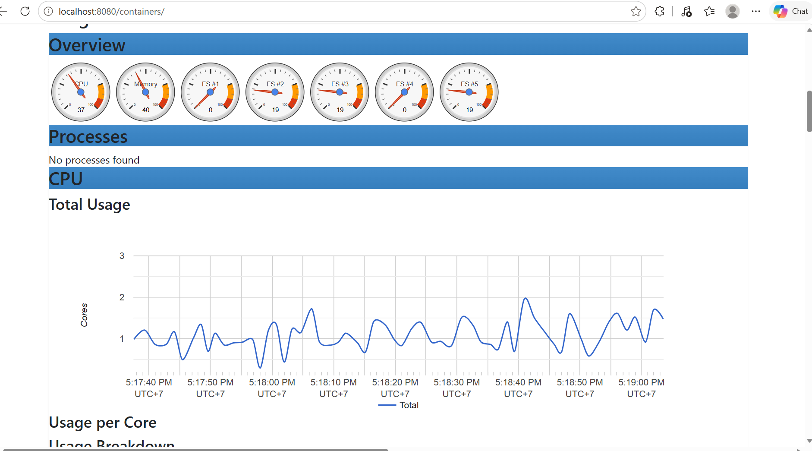
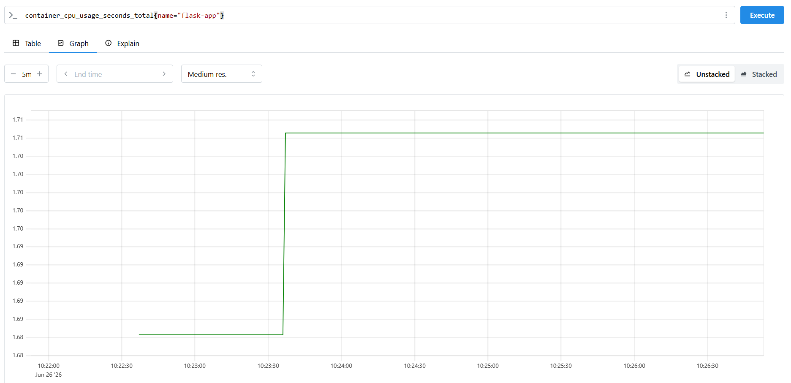

## Monitoring Lab with cAdvisor & Prometheus

### Objective
Build a simple monitoring stack to collect and visualize Docker container metrics using cAdvisor and Prometheus.

### Components
- **Flask App**: Sample application running inside a Docker container.
- **cAdvisor**: Collects CPU, memory, filesystem, and container metrics.
- **Prometheus**: Scrapes metrics from cAdvisor and stores them as time-series data.

### Steps
1. Run the Flask application in a Docker container.
2. Start cAdvisor to expose container metrics at `/metrics`.
3. Configure Prometheus to scrape metrics from cAdvisor.
4. Verify metrics through the Prometheus UI.
5. Query container metrics such as:
   ```
   container_cpu_usage_seconds_total{name="flask-app"}
   ```

### Result
- Successfully monitored the Docker container using cAdvisor.
- Prometheus scraped and stored container metrics.
- Verified CPU usage metrics of the `flask-app` container through Prometheus queries.
- Accessed the cAdvisor dashboard to observe real-time container resource usage.

### Output

