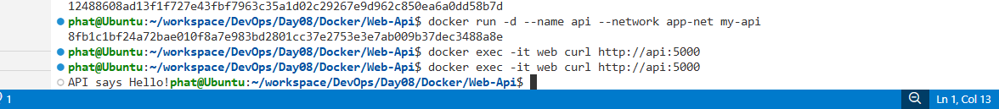

# Notes

## Objective

Learn how containers communicate with each other using a custom Docker network.

## What I Learned

* Built a simple Flask API as a Docker image.
* Created a custom bridge network (`app-net`).
* Ran Nginx and Flask containers in the same network.
* Accessed the Flask API from another container using its container name.
* Verified container communication with `curl`.
* Inspected Docker networks for troubleshooting.

## Commands

```bash
docker build -t my-api .

docker network create app-net

docker run -d --name web --network app-net -p 8080:80 nginx

docker run -d --name api --network app-net my-api

docker exec -it web curl http://api:5000

docker network ls
docker network inspect app-net
```


