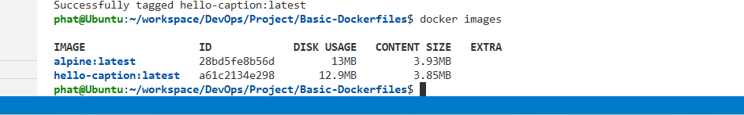

# Basic Dockerfile

## Objective

Create a simple Docker image using Dockerfile and run a container that prints:

```text
Hello, Captain!
```

## Dockerfile

```dockerfile
FROM alpine:latest

CMD ["echo", "Hello, Captain!"]
```

## Build Image

```bash
docker build -t hello-caption .
```

### Build Result


## Verify Image

```bash
docker images
```

### Available Images



## Run Container

```bash
docker run hello-caption
```

### Container Output


