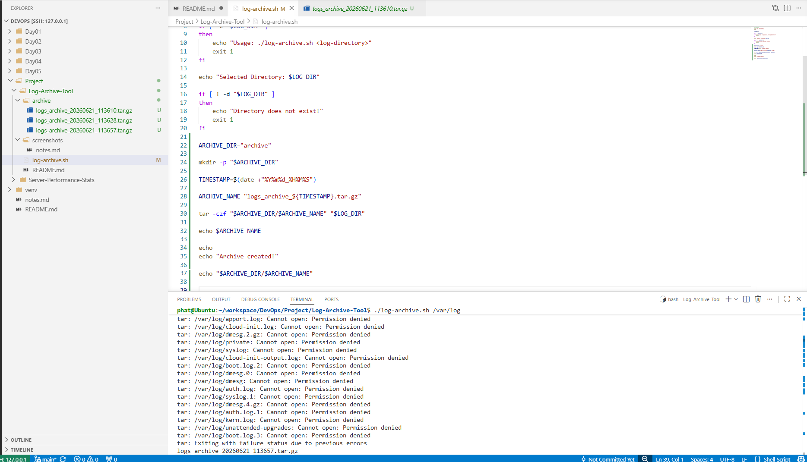

# Log Archive Tool

## Objective

Create a Bash script to archive log files by compressing them into a `.tar.gz` file.

## Features

* Accept log directory as input
* Validate directory existence
* Create archive folder automatically
* Generate timestamp-based archive names
* Compress logs into `.tar.gz`

## Project Structure

```text
Log-Archive-Tool/
├── archive/
├── screenshots/
├── log-archive.sh
└── README.md
```

## How to Run

```bash
chmod +x log-archive.sh
./log-archive.sh <log-directory>
```

Example:

```bash
./log-archive.sh /var/log
```

## Output



