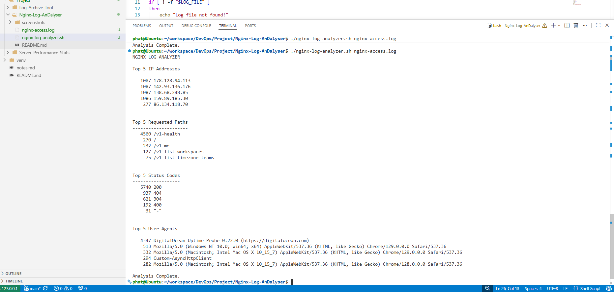

# Nginx Log Analyzer

## Objective

Analyze Nginx access logs using Bash scripting.

## Features

- Top 5 IP Addresses
- Top 5 Requested Paths
- Top 5 Status Codes
- Top 5 User Agents

## How to Run

```bash
chmod +x nginx-log-analyzer.sh
./nginx-log-analyzer.sh nginx-access.log

```
## Output


