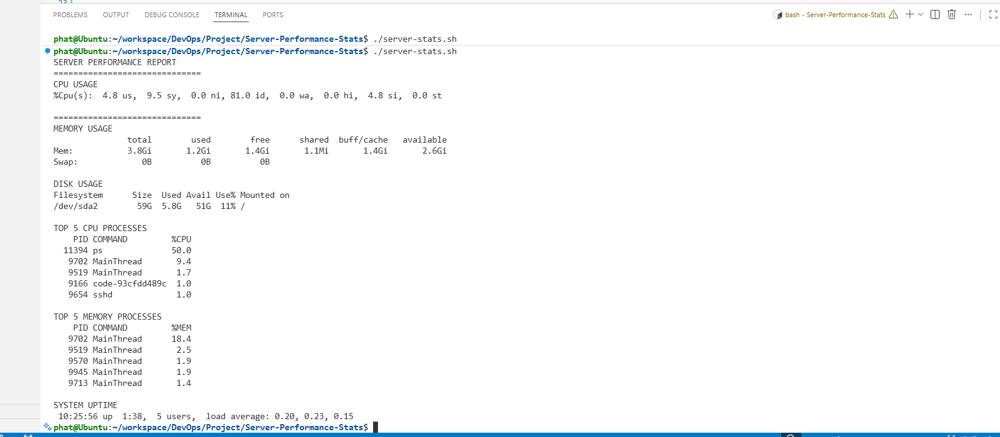

# Server Performance Stats

Project URL: https://roadmap.sh/projects/server-stats

## Objective

Analyze basic Linux server performance metrics using Bash.

## Features

- CPU Usage
- Memory Usage
- Disk Usage
- Top 5 CPU Processes
- Top 5 Memory Processes

## How to Run

```bash
chmod +x server-stats.sh
./server-stats.sh

```
## Output



