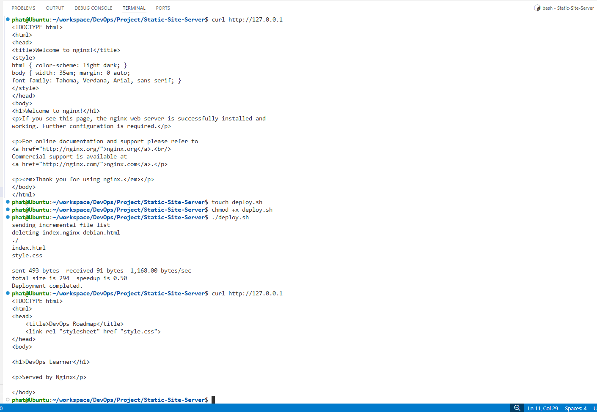

# Static Site Server

## Objective

Deploy a simple static website using Nginx and automate deployment with rsync.

## Features

* Install and configure Nginx
* Serve a static website
* Deploy website files using rsync
* Access website through a web browser

## Project Structure

```text
Static-Site-Server/
├── website/
│   ├── index.html
│   └── style.css
├── deploy.sh
├── screenshots/
└── README.md
```

## Deploy Website

```bash
chmod +x deploy.sh

./deploy.sh
```

## Verify Nginx

```bash
systemctl status nginx
```

## Screenshots

### Nginx Service


### Website




# Static Site Server with AWS

## Objective

Deploy a static website to an AWS EC2 instance using Nginx and rsync.

## Features

* AWS EC2 server
* SSH remote access
* Nginx web server
* Static HTML website
* File deployment with rsync

## Architecture

Local Ubuntu VM
→ rsync
→ AWS EC2
→ Nginx
→ Browser

## Deployment Steps

1. Launch an Ubuntu EC2 instance.
2. Connect to the server using SSH.
3. Install and start Nginx.
4. Create a static website.
5. Deploy files using rsync.
6. Serve the website through Nginx.

## Commands

### Connect to EC2

```bash
ssh -i phat-key.pem ubuntu@<public-ip>
```


### Deploy Website

```bash
rsync -avz \
-e "ssh -i ~/aws-key/phat-key.pem" \
./website/ \
ubuntu@<public-ip>:/tmp/website/
```

### Copy Files to Nginx

```bash
sudo rsync -av /tmp/website/ /var/www/html/
sudo systemctl reload nginx
```

## Result

The website is accessible through the EC2 public IP address.


